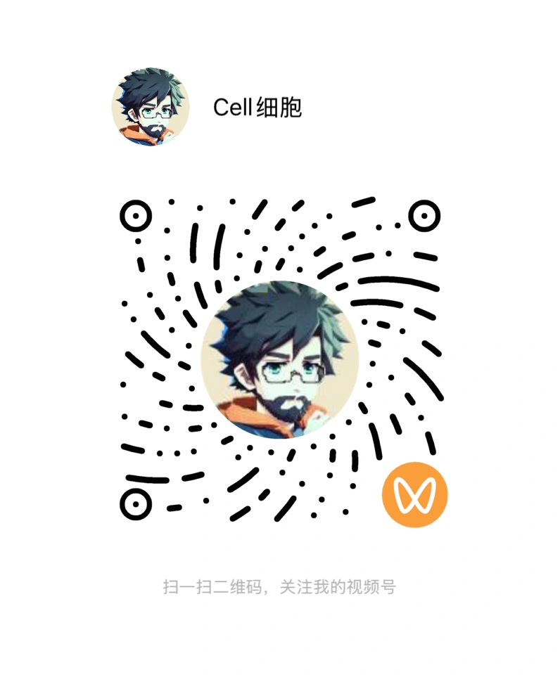

# H3 2.5D 狙击挑战

一个由 MiniMax Code 构建、把 H3 动态场景变成可玩空间的桌面浏览器狙击挑战。

玩家先在完整场景中观察和移动准星，开镜后自动进入准星所在的局部视野。在位置暴露前找到隐藏目标并完成射击，否则会被对方抢先发现。

玩家先在完整动态场景中移动准星，右键开镜后自动进入准星所在的局部视野。在 22 秒的隐藏时限内找到目标并完成唯一的一枪，否则会被对方先一步锁定。

## 已实现

- 开始页、场景选择、宽景观察、开镜、单发射击、成功、超时失败与重玩；
- 宽景和 2.6 倍瞄准镜共享同一个 `HTMLVideoElement`、同一 `currentTime` 和同一 16:9 源裁切；
- `4 × 3` 逻辑定位网格与归一化坐标，不为每格创建一条容易失去连续性的视频；
- 原创透明目标、同坐标 hitbox、无数字倒计时的两级危险提示；
- MiniMax Speech 2.8 任务语音、视频环境音静音联动和 Web Audio 交互反馈；
- 缺失媒体阻断、视频自动播放恢复、窗口比例与高 DPR 画布对齐；
- 8 个测试文件、127 项测试，以及 TypeScript + Vite 生产构建。

本仓库只保存代码、Prompt、参数与复现说明。H3 视频、语音、截图、录屏、账户信息和 API Key 不进入公开 Git 历史。

## 操作

- 移动鼠标：观察或移动镜内准星；
- 鼠标右键：开镜 / 退出瞄准镜；
- 鼠标左键：镜内射击，仅有一发；
- `M`：开启 / 关闭所有声音；
- `Esc`：退出瞄准或返回；
- `Enter`：开始或重玩。

## 本地运行

需要 Node.js 20+。

```bash
git clone https://github.com/cellinlab/h3-2-5d-sniper-challenge.git
cd h3-2-5d-sniper-challenge
npm install
npm test
npm run dev
```

打开终端显示的本地地址。生成媒体不随仓库分发，因此第一次进入任务会看到“任务素材未就绪”；按下一节准备两个本地文件即可试玩。

## 准备本地媒体

创建 `public/generated/`，放入：

```text
public/generated/north-relay-h3-4s-1080p-runtime.mp4
public/generated/target-operative.png
```

- 视频：任意可在浏览器解码的 16:9 H.264 MP4；建议固定机位。当前场景会循环播放，宽景和瞄准镜自动共享时间轴。项目实战版把原始 `1344×768` H3 文件居中裁为 16:9，用 ffmpeg 对首尾画面与音轨做 0.5 秒交叉淡化，再以 Lanczos 重采样至 1080P 并轻微锐化；这是浏览器运行衍生版，不宣称为原生 2K。
- 目标：带透明通道的虚构人物或机器人 PNG。默认标定点为 `(u=0.625, v=0.7)`，可在 [`src/scenes/sceneConfig.ts`](src/scenes/sceneConfig.ts) 修改位置、尺寸和命中范围。

最终 H3 文件可替换上述 MP4，或把 `masterMedia.src` 改为新的本地路径。不要提交生成媒体、供应商响应或账户 ID。

## 生成 MiniMax Speech

复制本地环境文件并只在自己的机器上填入 Key：

```bash
cp .env.example .env.local
# 编辑 .env.local：MINIMAX_API_KEY=你的本地 Key
npm run media:minimax:speech
```

脚本使用 `/v1/t2a_v2`、`speech-2.8-hd`、系统音色 `Chinese (Mandarin)_Reliable_Executive`，生成七条短任务语音到 `public/generated/audio/`。`.env.local` 和音频目录均已被 Git 忽略。

`npm run media:minimax:music` 只保留可复现实验入口；当前项目没有生成或使用 MiniMax Music 资产，背景声来自视频，精确交互音效来自 Web Audio。

## H3 提示词与真实尝试

完整 Prompt 和参数记录见 [`prompts/h3-scene.md`](prompts/h3-scene.md)。实际尝试保留了两个结果：

1. `MiniMax-H3 / 15s / 2K / 16:9` 在生成前被 1950 credits 的计费校验拦截，没有输出资产；
2. 保持参考图与固定机位 Prompt 不变，仅降为 `4s / 768P` 后，在现有 400 credits 内成功生成 H3 成片：`1344×768`、24 FPS、H.264 + 32 kHz AAC 立体声、约 4.46 秒。

下载后又完成了逐帧接触表、首尾对比、音轨探测和真实游戏验收。建筑构图保持稳定，蒸汽、云与警示灯有轻微变化；原始 768P 在 2.6 倍镜内略软，因此游戏使用前述 1080P 循环衍生版，原始 H3 文件仍完整保留在本地证据中。

## 架构

```text
SceneConfig / validation
        ↓
one master HTMLVideoElement
        ├── wide Canvas: full 16:9 source
        └── scope Canvas: same frame + normalized crop + 2.6×
                         ↓
transparent target + shared hitbox
                         ↓
round state machine: observe → scope → success / failure
```

- [`src/components/SceneStage.tsx`](src/components/SceneStage.tsx)：媒体、宽景与镜内 Canvas、目标合成和指针映射；
- [`src/state/roundStateMachine.ts`](src/state/roundStateMachine.ts)：一次射击、危险升级、超时与重置；
- [`src/state/validation.ts`](src/state/validation.ts)：扩展协议校验并拒绝未知字段；
- [`src/scene/videoSource.ts`](src/scene/videoSource.ts)：视频源裁切和媒体就绪判断；
- [`src/audio/audio.ts`](src/audio/audio.ts)：语音播放、Web Audio 音效与统一静音；
- [`specs/`](specs/VISION.md)：愿景、设计与验收标准；
- [`prompts/`](prompts/README.md)：H3、Speech 与 Music 的提示词和真实参数记录。

## 验证

```bash
npm test
npm run build
```

除单元测试外，项目还在真实浏览器中验证了：准星对应开镜位置、镜内一次命中、22 秒超时、两级危险提示、重玩重置、静音联动、开镜退出时视频不重置，以及临时移走 MP4 后的友好错误界面。

## 联系我

👋 Hi，我是 Cell 细胞。可以扫码加我微信，备注 **Github** 就行。

我正在做订阅制真人秀 **造物矩阵·BIP**：👉 [zaowujuzhen.com](https://zaowujuzhen.com/about)，欢迎订阅。

更多信息：👉 [Cell 的个人说明书](https://chaojizhizao.feishu.cn/wiki/Gbm8wMdS1itpk7kIVRlcN2WCnw)

<table align="center">
  <tr>
    <td align="center" width="33%">
      <br>
      <p align="center">扫码加微信</p>
    </td>
    <td align="center" width="33%">
      <br>
      <p align="center">视频号</p>
    </td>
    <td align="center" width="33%">
      <br>
      <p align="center">公众号</p>
    </td>
  </tr>
</table>

## 赞助

<table align="center">
  <tr>
    <td align="center" width="50%">
      <br>
      <p align="center">支付宝</p>
    </td>
    <td align="center" width="50%">
      <br>
      <p align="center">微信赞赏</p>
    </td>
  </tr>
</table>

## License

MIT
